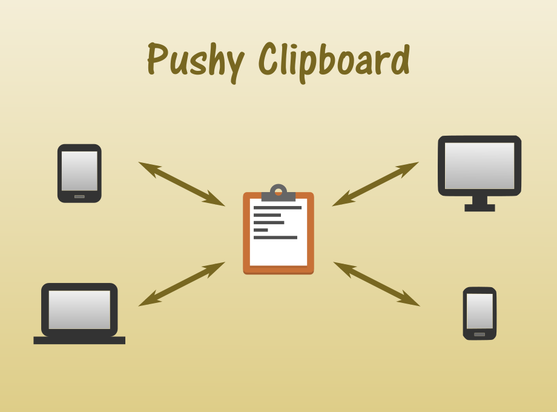

# Pushy Clipboard Chrome Extension

Monitor, store, and manage all text placed on the clipboard.
Mark favorite items for easy access.

Share between your devices using push notifications:

Any desktop hardware that supports the Chrome Browser using the

[Pushy Clipboard Chrome Extension](https://chrome.google.com/webstore/detail/pushy-clipboard/jemdfhaheennfkehopbpkephjlednffd)

Android phones and tablets using the

[Pushy Clipboard app](https://play.google.com/store/apps/details?id=com.weebly.opus1269.clipman)

&nbsp;&nbsp;

It is implemented using Vanilla JavaScript and [Polymer](https://www.polymer-project.org/1.0/).

